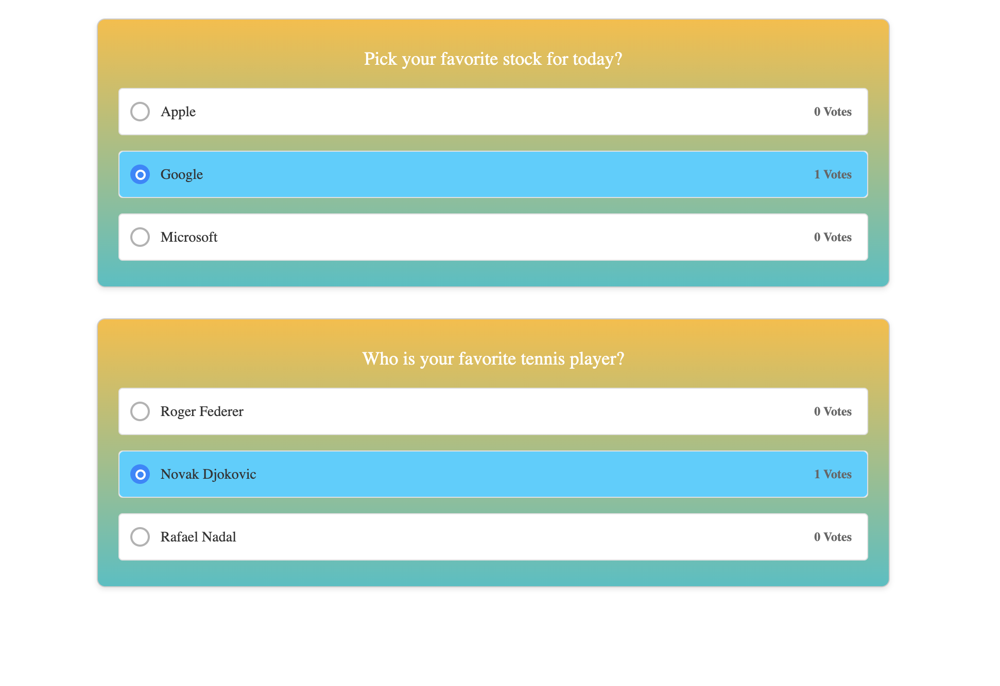

# Poll Widget

An embeddedable poll widget that can be used to create polls with configurable questions and options

Screenshot:


## Launching and Testing the Application

- **Set Up the Environment**: Ensure you have Node.js installed on your machine. If not, download and install it from the official website.

- **Install Dependencies**: Navigate to the project directory in your terminal and run `npm install` to install all the required dependencies specified in the package.json file.

- **Run the Application**: You can run your application using a development server like live-server or simply by opening the `index.html` file in your browser. There are 2 sample static HTML files `poll1.html` and `poll2.html` that can be simply opened in your browser or through live-server to see the poll widget in action. `index.html` contains multiple poll widgets. All the html pages uses the [poll-widget.min.js](poll-widget.min.js). To see unminified/source of poll widget check [here](poll-widget.js).

- **Test the Application**: Open another terminal window and navigate to your project directory. Run the Jest tests using the command `npm run test`. This will execute all the tests defined in your poll-widget.test.js file and provide feedback on their success or failure.

## Summary

`poll-widget.js` is a customisable poll widget that can be embedded in any html pages. It has a `createPollWidgetContainer(config)` function that can be configured with your widgetId, question and options and to render the poll you need to call the `init()` handler

Usage:

```
const widgetOptions = {
  dataWidgetId: 'widget-1',
  dataPollOptions: '["Option 1", "Option 2", "Option 3"]',
  dataPollQuestion: 'Which option do you prefer?'
};
const pollWidget = createPollWidgetContainer(widgetOptions);
pollWidget.init();
```

#### Important function:

`handleVote()` is triggered when a user submits his response and it updates the poll result and adds an active style to the selected option and saves it in the localStorage.

### Improvements:

Currently there is no way to customise the styling of the poll widget, that can be added so as to give a different look and feel to each of the poll-widget.
